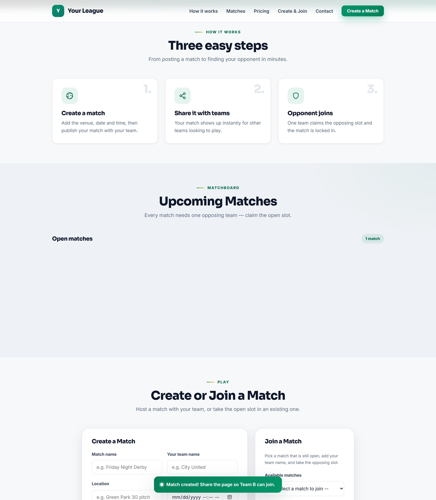
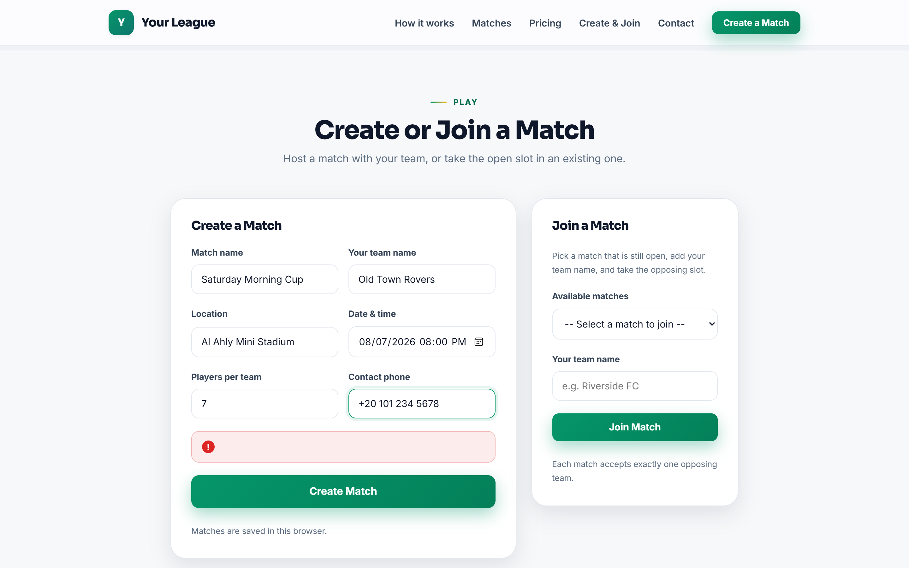
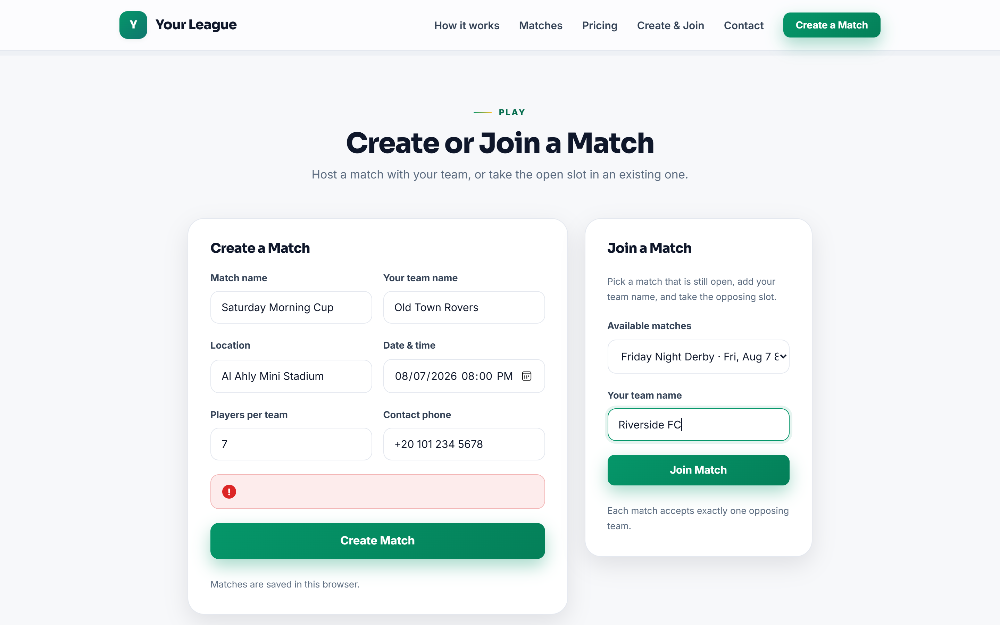

# Football Match Booking — White-label Website Template

> **White-label, client-ready match website.** Rebrand, deploy, deliver.

A premium, mobile-first match organizer for football venues, leagues and clubs. Team A **creates a match**, the match appears on the matchboard, and one opposing team claims the open "Team B" slot — no registration, no fees, no server required.

This is a **commercial white-label product**: one codebase, rebranded per client from a single config file. Sell it to football venues, 5-a-side centers, leagues or sports clubs.

**Live demo:** https://booking-template-demo.vercel.app

---

## Screenshots

| | |
| --- | --- |
| **Hero** | **How it works & Matchboard** |
|  |  |
| **Create a match** | **Join as Team B** |
|  |  |
| **Mobile view** | **Full page** |
|  |  |

---

## Features

- **Matchboard** — every created match is listed with its venue, date and time, plus an open or full status.
- **Create a match (Team A)** — match name, team name, location, date & time, players per side and contact phone.
- **Join a match (Team B)** — one team claims the open slot; the match locks in as **A vs B**.
- **One opponent rule** — a full match cannot be joined again; the slot disappears from the join list.
- **Match management** — the owner can cancel a match; the board updates instantly.
- **Live hero card** — the hero visual shows real data (open matches count / board status), not placeholder text.
- **Premium design system** — typography scale, spacing scale, layered shadows, smooth reveal-on-scroll and micro-interactions that respect `prefers-reduced-motion`.
- **Form validation** — required fields, future date and phone format checks with friendly error messages.
- **Zero build step** — plain HTML, CSS and JavaScript. Open the folder and it works.
- **Theme via CSS variables** — brand colors applied automatically from the config.
- **Optional Supabase sync** — a shared matchboard across visitors with a free Supabase project (see below).
- **Accessible & responsive** — keyboard-friendly, mobile-first, no overflow at 375 / 768 / desktop widths.

## Technologies Used

- **HTML5, CSS3** — flexbox, grid, CSS custom properties (design tokens).
- **Vanilla JavaScript (ES6)** — no frameworks, no dependencies.
- **Persistence** — `localStorage` by default; optional **Supabase** via REST API (no client library).
- **Fonts** — Sora (display) and Inter (body) from Google Fonts, with local fallbacks.
- **Hosting** — deployable to any static host (Vercel, Netlify, GitHub Pages); a `vercel.json` is included.

## Project Structure

```
booking-template/
├── index.html              # Single-page site
├── vercel.json             # Vercel static site config
├── README.md               # This file
├── screenshots/            # Marketing screenshots
└── assets/
    ├── css/main.css        # Design system + all section styles
    └── js/
        ├── config.js       # ALL client customization lives here
        ├── storage.js      # Persistence layer (localStorage + optional Supabase)
        ├── matches.js      # Match engine (create, join, one-opponent rule)
        └── main.js         # Branding/theme application + section rendering
```

## Customization Through `config.js`

**Everything a client needs to change lives in one file:** `assets/js/config.js`.

| Setting | Config key | Notes |
| --- | --- | --- |
| Business name | `business.name` | Also used as the browser tab title and footer |
| Tagline | `business.tagline` | Shown near the logo and hero |
| Logo | `business.logo` | `type: "text"` (name as logo) or `"image"` with a file path |
| Brand colors | `business.primaryColor` / `secondaryColor` / `accentColor` | Applied as CSS variables across the site |
| Hero text & buttons | `hero.*` | Eyebrow, headline, subtext, CTA labels and pills |
| "How it works" steps | `steps[]` | Title, description and icon name — set `[]` to hide |
| Contact details | `contact.phone` / `whatsapp` / `email` / `address` / `hours` | Cards render only for filled values |
| Pricing plans | `packages[]` | `price: 0` shows "Contact Us"; `highlight: true` features a card |
| Default player count | `match.defaultPlayers` | Pre-filled "players per team" in the create form |
| Storage | `database.provider` | `"local"` or `"supabase"` |

> Tip: all text is rendered as plain text (no HTML), so write normal sentences.

Typography and layout tokens live in `assets/css/main.css` under `:root` — fonts (`--font-display`, `--font-body`), spacing scale (`--s1` … `--s20`), radii and shadows. To go fully offline or swap fonts, remove the two `<link>` font tags in `index.html` and edit the font variables.

## Quick Start

No installation or build step is required.

1. Open `index.html` in any modern browser (double-click the file), **or**
2. Run a local server:

```bash
cd booking-template
python -m http.server 8000
```

Then open `http://localhost:8000`.

## Deployment

The site is 100% static, so deployment is free and instant.

### Option A — Vercel Dashboard (recommended)

1. Push this folder to a GitHub repository.
2. Go to [vercel.com](https://vercel.com/new) and click **Import** next to the repository.
3. Framework preset: **Other**. Root directory: select `booking-template` (the folder with `index.html`).
4. Click **Deploy**. No build command is needed.

### Option B — Vercel CLI

```bash
cd booking-template
npx vercel deploy --prod
```

The site is served at `https://booking-template.vercel.app` (the project name comes from `vercel.json`). To connect a custom domain, add it in **Project Settings → Domains**.

### Option C — Any static host

Serve the folder as-is. `index.html` is the entry point.

## Data Storage

### Default: browser-only (localStorage)

Matches are saved in the visitor's browser under the key `booking-template.matches`. This is the fastest way to demo the site or use it for a single organizer. Different visitors do **not** share the same matchboard in this mode.

### Optional: Supabase (shared matchboard)

To let all visitors see and join the same matches, connect a free Supabase project:

1. Create a project at [supabase.com](https://supabase.com) and open the **SQL editor**.
2. Run this setup script:

```sql
create table if not exists matches (
  id text primary key,
  name text not null,
  team_a text not null,
  team_b text,
  location text not null,
  time timestamptz not null,
  players integer,
  phone text not null,
  created_at timestamptz default now()
);

alter table matches enable row level security;

-- anyone (with the anon key) can read the matchboard
create policy "public read matches"
  on matches for select using (true);

-- the anon key can insert a new match (and update when joined)
create policy "public insert matches"
  on matches for insert with check (true);

-- anyone can delete a match (used by the owner's cancel button)
create policy "public delete matches"
  on matches for delete using (true);
```

3. Open **Project Settings → API** and copy the **Project URL** and **anon public key**.
4. In `assets/js/config.js`, set:

```js
database: {
  provider: "supabase",
  supabaseUrl: "https://YOUR-PROJECT.supabase.co",
  supabaseAnonKey: "YOUR-ANON-KEY",
  matchesTable: "matches"
}
```

That's it. Matches are now read from and written to Supabase. The anon key is designed to be safe in the browser; access is enforced by the Row Level Security policies above.

## Adapting for Different Businesses

The template is content-driven, so it fits any match- or session-based sport with zero code changes:

- **Football / soccer venues** — the included steps, packages and match flow map directly.
- **5-a-side & 7-a-side centers** — change `match.defaultPlayers` and the pricing wording in `config.js`.
- **Other team sports** — rename the steps and hero copy; the A-vs-B match mechanic stays identical.
- **Private leagues & clubs** — hide the pricing section with `packages: []` and keep a pure matchboard.

Because empty sections hide automatically and `price: 0` renders "Contact Us", a client can ship a complete site without inventing content.

## Security Notes

- User and config text is inserted into the DOM as **text only** (never raw HTML), preventing XSS.
- Phone numbers and future match times are validated before saving.
- The Supabase anon key is safe to expose publicly because all access is gated by Row Level Security policies.
- In `local` mode no data leaves the browser.

## Notes for the Seller

- The repository root (`web project/`) contains the original Football Booking demo and is **not** part of this product.
- To resell: duplicate the `booking-template/` folder per client, edit `config.js`, and deploy each copy to its own Vercel project or domain.
- This README is written to hand off as-is to a client or a buyer of the template.
